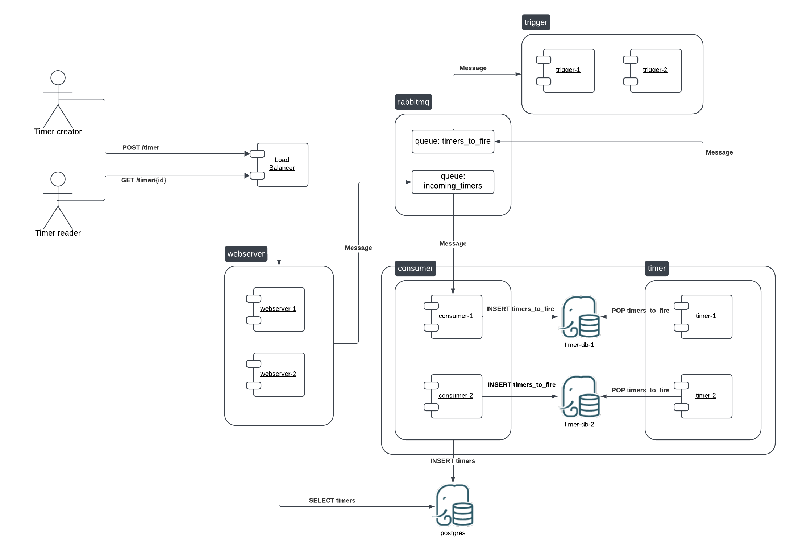
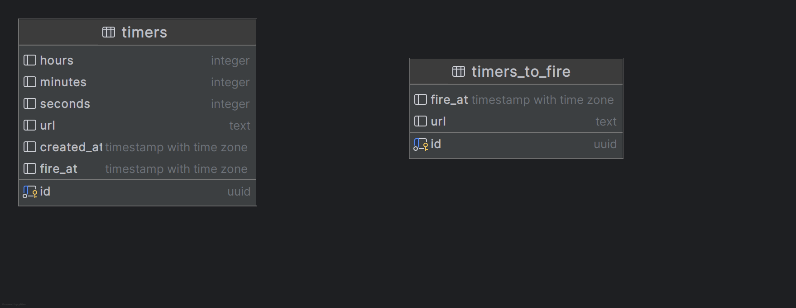

<!--
  Copyright (c) [2024] [Maksim Moiseenkov]

  Licensed under the Apache License, Version 2.0 (the "License");
  you may not use this file except in compliance with the License.
  You may obtain a copy of the License at

      http://www.apache.org/licenses/LICENSE-2.0

  Unless required by applicable law or agreed to in writing, software
  distributed under the License is distributed on an "AS IS" BASIS,
  WITHOUT WARRANTIES OR CONDITIONS OF ANY KIND, either express or implied.
  See the License for the specific language governing permissions and
  limitations under the License.
 -->

# Timer solution

**Table of contents**

- [Solution architecture](#solution-architecture)
- [How to build](#how-to-build)
- [How to run unit tests](#how-to-run-unit-tests)

# Solution architecture

## Components overview
In order to achieve scalability the application was broken down into a multiple smaller peaces:
1. **Load balancer** spreads requests (endpoints `POST /timer`, `GET /timer/{id}`) among `webserver` instances. 
It is implemented as a simple nginx service with a load balancing settings.
  - Other details:
    - Location in the project: `load-balancers/webserver`
    - Source image: `nginx:stable-alpine`
    - Container name: `load-balancer-webserver`
    - URL: http://localhost:80
    - Ports: `80`

2. **webserver** is scalable FastAPI application each instance of which provides endpoints ```POST /timer```, 
`GET /timer/{id}`, `GET /health`.
- `POST /timer` validates request body, generates unique UUID for the timer and sends message to `rabbitmq`
microservice to the queue `incoming_timers` for further processing. Because it might be a surge in user activity, instead of 
saving timer into a database directly, it sends a message to RabbitMQ cluster, so it could be processed soon by
`consumer`.
- `GET /timer/{id}` reads a timer from database (`postgres` microservice), calculated time left to firing a hook, 
and retrieves response.
- `GET /health` is a simple health check.
  - Other details:
    - Location in the project: `webserver`
    - Source image: custom from `webserver/Dockerfile`
    - Container name: `webserver-1`, `webserver-2`, ...
    - URL: http://localhost:8000, http://localhost:8001, ...
    - Ports: `8000`, `8001`, ...
    - API documentation:
      - http://localhost:80/docs
      - http://localhost:80/redoc
3. **rabbitmq** is a microservice running [RabbitMQ](https://www.rabbitmq.com) message broker. It is only handles messaging
between other microservices.
   - Other details:
     - Location in the project: -
     - Source image: `rabbitmq:3-management`
     - Container name: `rabbitmq`
     - URL: http://localhost:15672
     - Ports:
       - `5672` for communication with other microservices
       - `15672` for accessing RabbitMQ UI (login: `guest`, password: `guest`)
4. **consumer** is a scalable microservices responsible for pulling messages from the `rabbitmq`'s queue 
`incoming_timers` and saving them into a database into two tables: `timers` and `timers_to_fire`. The first table 
`timers` contains all original data about the timer. The second table `timers_to_fire` contains only timers that haven't
been fired yet. Once the moment comes they will be removed from this table by the `timer` microservice. At this point
the `consumer` is the only microservice that writes data to database. And all concurrent instances are not conflicting
because by consuming different messages from `rabbitmq` they will always add different rows to tables.
   - Other details:
     - Location in the project: `consumer`
     - Source image: custom from `consumer/Dockerfile`
     - Container name: `consumer-1`, `consumer-2`, ...
     - URL: -
     - Ports: -
5. **postgres** is a PostgreSQL instance
   - Location in the project: -
   - Source image: `postgres`
   - Container name: `timer-postgres-1`
   - URL: -
   - Ports: 5432
   - User: postgres
   - Password: postgres
   - Database name: postgres
6. **timer** is a single instance microservice which makes periodic requests to `postgres`'s table `timers_to_fire` and
if there are items that reached their waiting time, it (1) sends message to `rabbitmq`'s queue `timers_to_fire`, and (2)
removes these items from the database, so they'd never be triggered twice.
   - Other details:
   - Location in the project: `timer`
   - Source image: custom from `timer/Dockerfile`
   - Container name: `timer`
   - URL: -
   - Ports: -
7. **trigger** is a scalable microservice each instance of each waits for messages coming from the `rabbitmq`'s queue 
`timerf_to_fire` and once received, makes POST requests to the URL from the message.

## Data workflow
1. User sends a request POST http://localhost:80/timer to the `webserver`'s load balancer (`load-balancer-webserver`) 
with a body:
```json
{
  "hours": 4,
  "minutes": 0,
  "seconds": 1,
  "url": "https://someserver.com"
}
```
2. The `load-balancer-webserver` redirects the request to one of `webserver`'s instances according to a round-robin 
algorithm.
3. `webserver` instance validates the request body. If errors, then returns response with HTTP 422 status code and an
error message. If validation is successful, generates UUID, packs data into a message and sends it to the `rabbitmq` 
microservice to the queue `incoming_timers`.
4. Any instance of `consumer` microservice receives this message and saves data to `postgres` to tables:

5. The `timer` microservice constantly requests the `timers_to_fire` table in order to detect items that reached their firing
moment. If such items detected, the `timer` (1) packs them into a message, (2) sends the message to `rabbitmq` (queue
`timers_to_fire`) and removes item from the database.
6. Any instance of `trigger` microservice receives the message from the queue `timers_to_fire` and makes request `POST 
{url}` with a body:
```json
{
  "id" : "be18064e-d265-4cb5-9716-34f249029a79"
}
```

# How to build
1. Create abd activate a Python virtual environment. This solution was tested for Python 3.11.9, and Docker 27.4.1.
```bash
python -m venv venv
source venv/bin/activate
```
2. Build images and start the application
```bash
docker compose up --build
```

# How to run unit tests
1. Activate virtual environment
```bash
source venv/bin/activate
```
2. Install requirements
```bash
pip install -r requirements.txt
```
3. Run tests
```bash
pytest tests
```